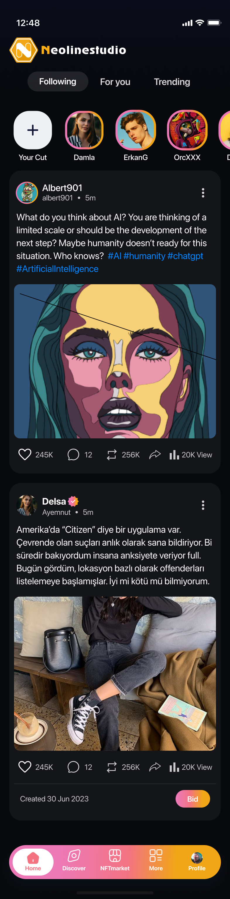
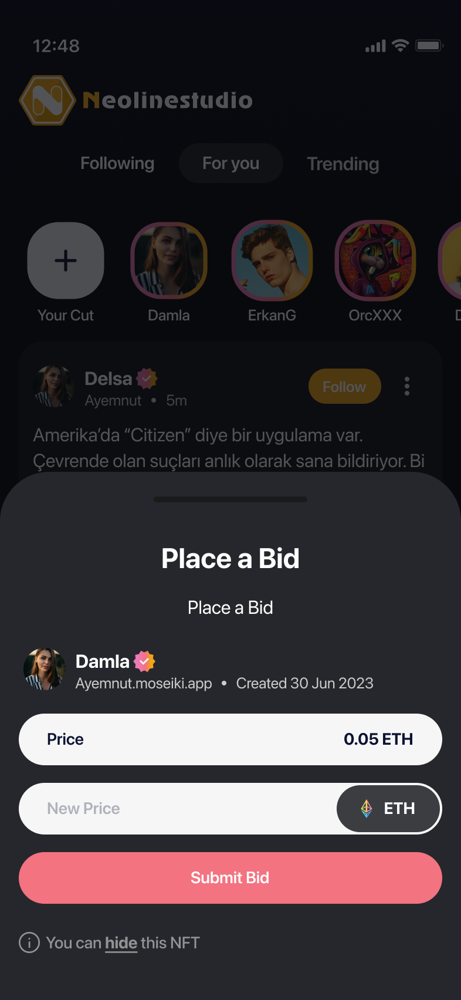

# InstaClone


<div style="display: flex; justify-content: space-around; align-items: left; flex-wrap: wrap;">
  
  
  
  
</div>

## Getting Started

# InstaClone


## About

This project is a starting point for a Flutter application, inspired by Instagram's UI and functionality.
Responsive Design Mastery : Implemented responsive design practices, ensuring seamless user experiences across various devices and screen sizes.

## Features

- Social interactions (likes, comments)
- omplexity in User Interface
- professional bottom sheets
## How to Run

1. Clone the repository:
   ```bash
   git clone https://github.com/your-username/instaclone.git

